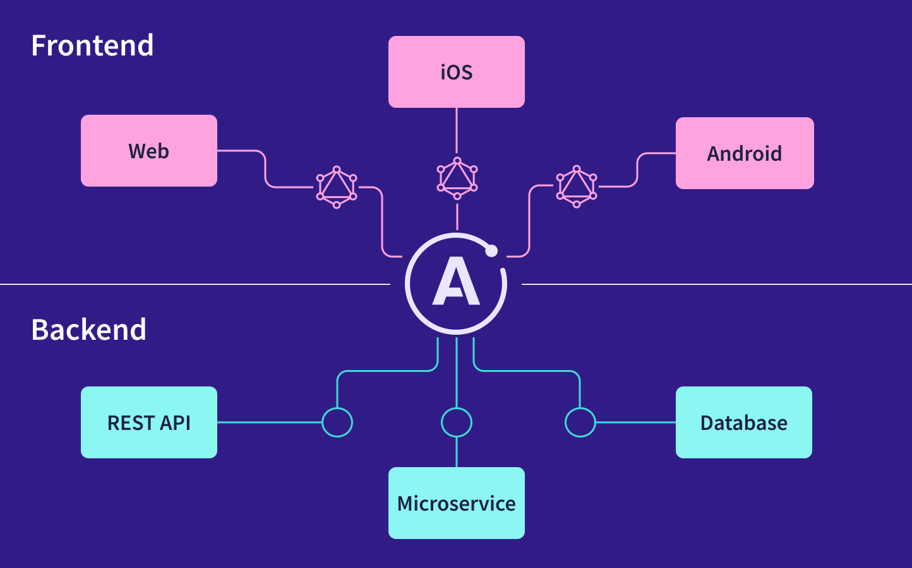

This is a [Next.js](https://nextjs.org/) project bootstrapped with [`create-next-app`](https://github.com/vercel/next.js/tree/canary/packages/create-next-app).

## Getting Started

First, run the development server:

```bash
npm run dev
# or
yarn dev
```

Open [http://localhost:3000](http://localhost:3000) with your browser to see the result.

You can start editing the page by modifying `pages/index.tsx`. The page auto-updates as you edit the file.

[API routes](https://nextjs.org/docs/api-routes/introduction) can be accessed on [http://localhost:3000/api/hello](http://localhost:3000/api/hello). This endpoint can be edited in `pages/api/hello.ts`.

The `pages/api` directory is mapped to `/api/*`. Files in this directory are treated as [API routes](https://nextjs.org/docs/api-routes/introduction) instead of React pages.

## Learn More

To learn more about Next.js, take a look at the following resources:

- [Next.js Documentation](https://nextjs.org/docs) - learn about Next.js features and API.
- [Learn Next.js](https://nextjs.org/learn) - an interactive Next.js tutorial.

You can check out [the Next.js GitHub repository](https://github.com/vercel/next.js/) - your feedback and contributions are welcome!

## Deploy on Vercel

The easiest way to deploy your Next.js app is to use the [Vercel Platform](https://vercel.com/new?utm_medium=default-template&filter=next.js&utm_source=create-next-app&utm_campaign=create-next-app-readme) from the creators of Next.js.

Check out our [Next.js deployment documentation](https://nextjs.org/docs/deployment) for more details.

## NextJs

Next.js gives you the best developer experience with all the features you need for production: hybrid static & server rendering, TypeScript support, smart bundling, route pre-fetching, and more. No config needed.

## Graphql

- GraphQL queries access not just the properties of one resource but also smoothly follow references between them. While typical REST APIs require loading from multiple URLs, GraphQL APIs get all the data your app needs in a single request. Apps using GraphQL can be quick even on slow mobile network connections.

- GraphQL APIs are organized in terms of types and fields, not endpoints. Access the full capabilities of your data from a single endpoint. GraphQL uses types to ensure Apps only ask for what’s possible and provide clear and helpful errors. Apps can use types to avoid writing manual parsing code.

- Know exactly what data you can request from your API without leaving your editor, highlight potential issues before sending a query, and take advantage of improved code intelligence. GraphQL makes it easy to build powerful tools like GraphiQL by leveraging your API’s type system.

## Apollo Client



### Features

- Declarative data fetching: Write a query and receive data without manually tracking loading states.

- Excellent developer experience: Enjoy helpful tooling for TypeScript, Chrome / Firefox devtools, and VS Code.

- Designed for modern React: Take advantage of the latest React features, such as hooks.

- Incrementally adoptable: Drop Apollo into any JavaScript app and incorporate it feature by feature.

- Support Typescript

- Universally compatible: Use any build setup and any GraphQL API.

- Community driven: Share knowledge with thousands of developers in the GraphQL community.

## Apollo Server

### Features

- A gateway for a federated supergraph
- The GraphQL server for a subgraph in a federated supergraph

- A stand-alone GraphQL server, including in a serverless environment
- An add-on to your application's existing Node.js middleware (such as Express or Fastify)

## Codegen Graphql

- Generate code from your GraphQL schema and operations with a simple CLI

- Generate code from your GraphQL schema and GraphQL operations with a single function call regardless of your environment or code format

- Plugins that support multiple library e.g react-query, react-apollo, typescript and many more.

## Chakra Ui

- Chakra UI is a simple, modular and accessible component library that gives you the building blocks you need to build your React applications.

- Spend less time writing UI code and more time building a great experience for your customers.

- Chakra UI strictly follows WAI-ARIA standards for all components.

- Customize any part of our components to match your design needs.

- Designed with composition in mind. Compose new components with ease.
